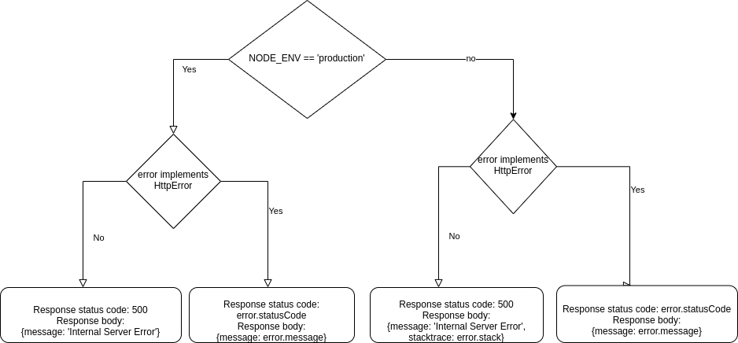

# error-express-handler

This package exports a middleware for express that handles Error and HttpError(custom package type).
## Install
```sh
npm install --save @map-colonies/error-express-handler
```

## Usage


```ts
import express from 'express';
import { getErrorHandlerMiddleware } from '@map-colonies/error-express-handler';

process.env.NODE_ENV = 'development';

const app = express();

app.use('/meow', fn);

app.use(getErrorHandlerMiddleware());

app.listen(8080, function() {
    console.log('server is up');
});
```

## Flow

